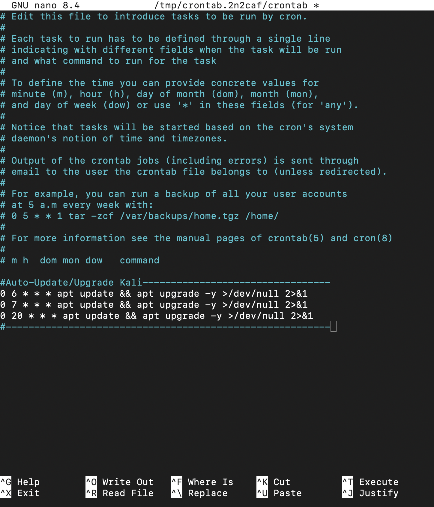

# May 8, 2025  

Study Update:

I've been drifting too much, realised my brain is not happy to sit in front of a screen reading/following endless instructions to learn basics
or even just to learn some commamds, it seems the best way for me to learn is hands on so I've updated my learning path to it's V3.0 version
it includes more hands-on tasks and projects to do rather than sitting in front of THM rooms endlessly. I will still include them in my study 
but they will be more softly incldued, they will be suff I can do maybe on my break at work or at other times. I want the projects to be the main
driver of my motivation and learning because otherwise this is not going to work.

I set up this plan to work so I can obtain certificates while doing them, also so I learn basics/fundamentals as I go along these projects
the first one it's going to be a Network Cartographer, sounds fun and very hands on. I'm constantly getting more and more intrigued by
the Network part of cybersecurity. 

---

## 🧠 What I Learned:
- So, I've been this early morning from the time I woke up, finished up the SSH nickname (thought it would be annoying to put an IP everytime)
so now it works easily.
-I also switched my GUI from Gnome to Xfce because according to Jarvis "Xfce runs better if your plan is to use it on a VNC", so I switched it
to Xfce.
-While doing the Xfce change/update realised Kali updates itself quite often, in fact maybe it was an upgrade of apps not an update, but still,
if I wouldn't have run the update again out of curisity I wouldnt have been fully up-to-date so this made me think of automating it, seems too
much effort to update it myself everytime I use the box just to make sure is up-to-date.
-Learned how to set up a Crontab automation, I'll post a snippet of my automation, I'm proud it looks so tidy.

## ❓ What Confused Me:
- N/A 

---

## 🛠️ Build Summary:
- N/A
---

## ⏭️ Next Steps:
- Set up a Dynamic DNS
- Set up a Port-Forwarding protocol so I can access my linux box from anywhere.

## 📊 Plan Check:
- So far, this plan is working much better than the previous sit, read and learn one.
